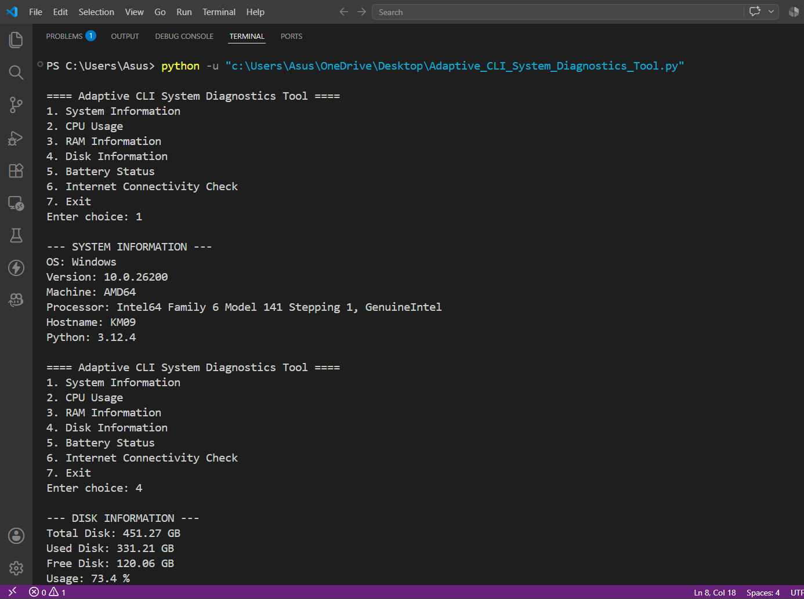
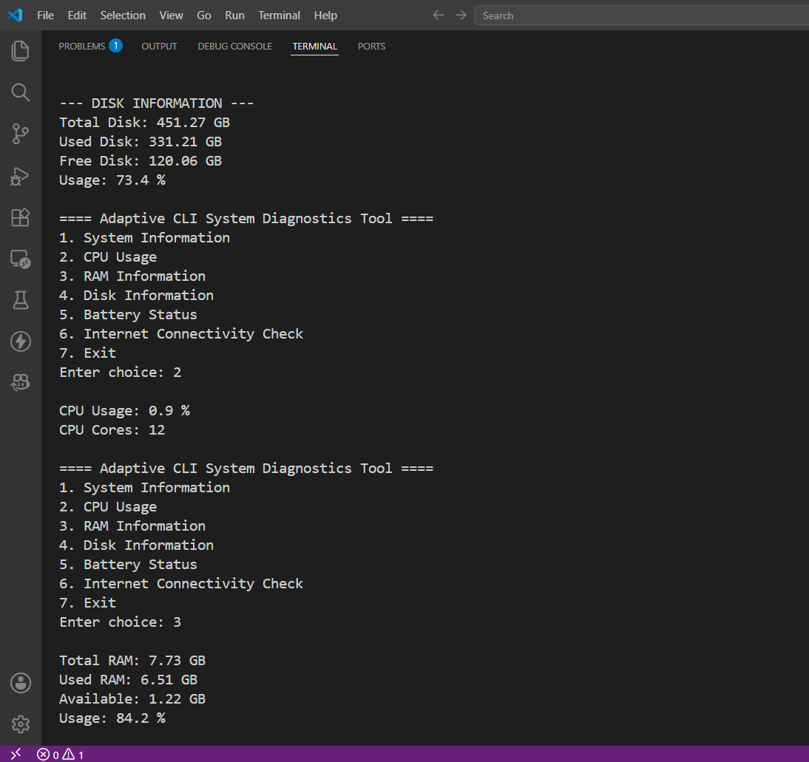
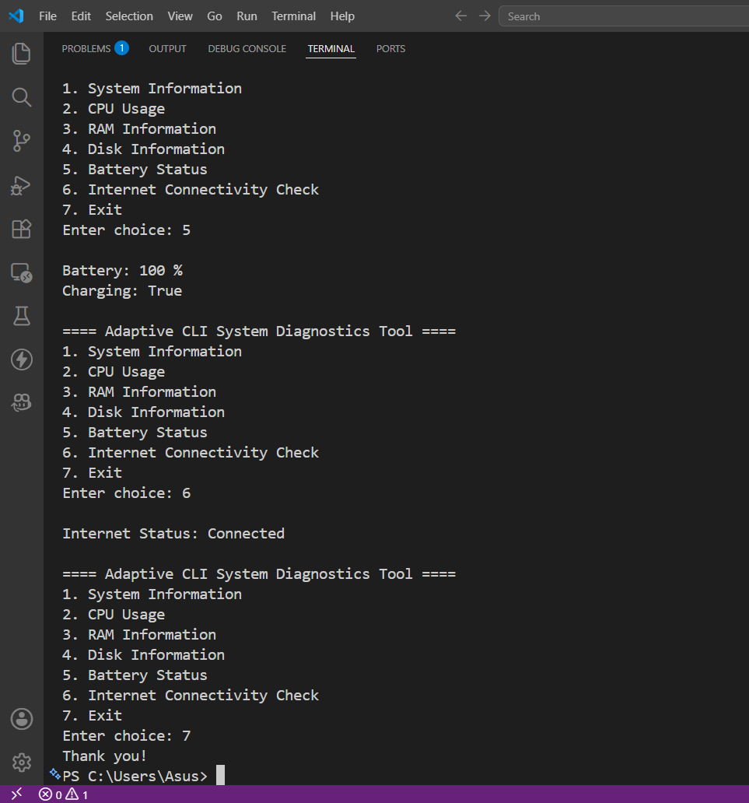

## Name
Krish Mathur

## Registration no.
24BCE10068

# Adaptive CLI System Diagnostics Tool

A simple Python Command Line Interface (CLI) project that displays basic system information.

## Features
- System Information
- CPU Usage
- RAM Information
- Disk Information
- Battery Status
- Internet Connectivity Check

## Requirements
- Python 3.x
- psutil

# Adaptive CLI System Diagnostics Tool

## Screenshots

### Image 1


### Image 2


### Image 3


## Install

```bash
pip install psutil
